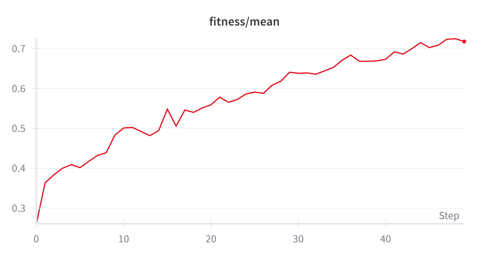
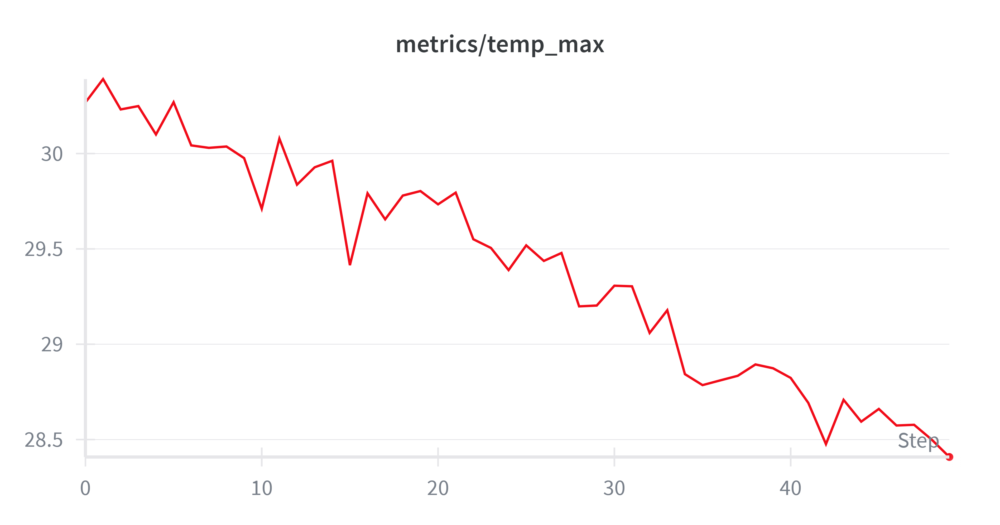
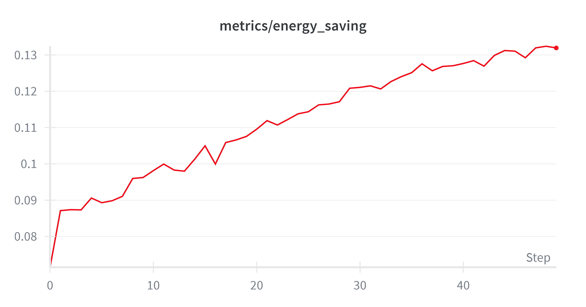
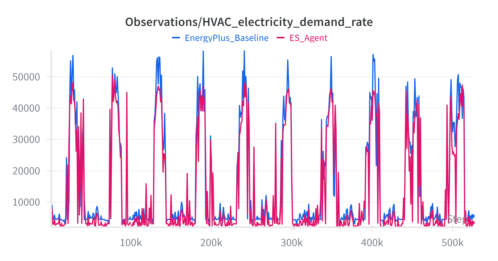
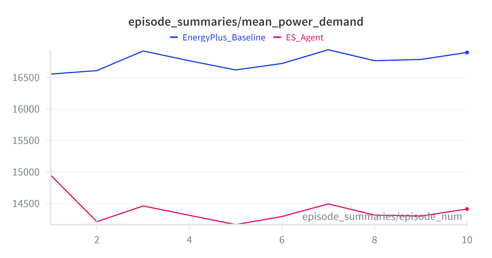
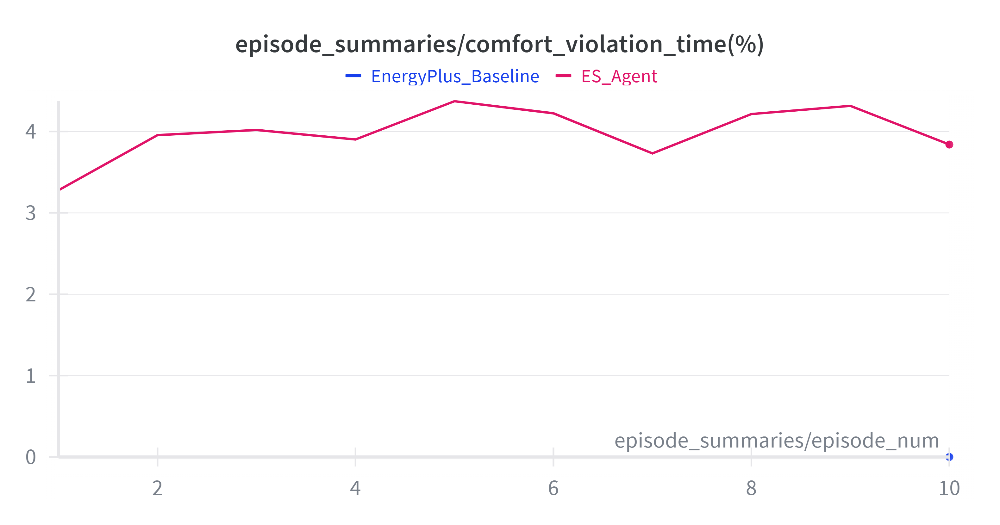

## Table of Contents

1. [Introduction](#1-introduction)
2. [Soft-Actor-Critic based model](#2-soft-actor-critic-based-model)
   1. [Environment description](#21-environment-description)
   2. [Custom Reward Function](#22-custom-reward-function)
   3. [Training](#23-training)
   4. [Results](#24-results)
3. [Evolutionary Strategies](#3-evolutionary-strategies)
   1. [Fitness Function Design](#31-fitness-function-design)
   2. [Architecture and Training Design](#32-architecture-and-training-design)
   3. [Results](#33-results)
4. [Conclusions](#4-conclusions)
      
# 1. Introduction

Data centers are among the most power-consuming infrastructures worldwide, and a substantial portion of their total energy usage is devoted to cooling. Server reliability depends on maintaining safe thermal conditions, yet traditional static or rule-based cooling strategies often lead to severe energy inefficiencies. This project addresses the Data Center Cooling Optimization Problem through intelligent control techniques based on Reinforcement Learning.

The entire work is carried out in a Sinergym-based environment.  
Sinergym[[Jiménez-Raboso et al.]](https://ugr-sail.github.io/sinergym/compilation/main/index.html) is a Python framework that integrates EnergyPlus[[DOE]](https://energyplus.net/), a building-level simulation engine, with the Gymnasium API. This makes it possible to control realistic HVAC (**Heating, Ventilation & Air Conditioning**) systems using RL agents.

In simple terms, the agent learns how to reduce unnecessary energy consumption without letting temperatures exceed safe limits for IT equipment.

Formally, the two main goals of the agent are:

- **Maintaining thermal comfort:** keeping the internal air temperature of the datacenter within the optimal comfort range of **18°C–27°C** (ASHRAE recommended level [ref]).  
- **Reducing energy consumption:** minimizing the total **HVAC electricity demand** compared to a static baseline (e.g., fixed setpoint at 21.5°C), while still maintaining acceptable comfort.

To explore different learning paradigms, the project evaluates **two control approaches**:  
a model-free **Soft-Actor-Critic (SAC)** agent and a gradient-free **Evolutionary Strategies (ES)** agent.  
Both aim to find the optimal balance between comfort and energy efficiency, maximizing overall performance.

# 2. Soft-Actor-Critic based model

This section presents the architecture and training procedure of the SAC agent designed for datacenter cooling control. After defining the environment and the observation–action structure, we describe the custom reward function used to balance thermal comfort and energy efficiency. Finally, we detail the training configuration and report the performance metrics obtained during evaluation.

The choice of SAC is not arbitrary. Prior work, including the study by **Bienmann et al.** [ref], shows that SAC provides **faster and more stable convergence** than other continuous-control RL algorithms in datacenter cooling tasks. This makes it a strong baseline for comparison with alternative methods such as ES.

## 2.1 Environment description

The training environment is the `Eplus-datacenter_dx-mixed-continuous-v1` model provided by Sinergym.  
It represents a **two-zone datacenter** equipped with an HVAC system controlled by a CRAC unit (Computer Room Air Conditioner).  
The simulation runs on **EnergyPlus**, using the **New York (USA) weather file**, which makes the task particularly challenging due to the strong seasonal variability: the climate alternates between very hot summers and extremely cold winters, forcing the cooling system to adapt to rapidly changing thermal loads.

### Datacenter Structure
The building model consists of:
- **East Zone** – server room area with heat-generating equipment  
- **West Zone** – second server room with similar load characteristics  

Both zones contribute to the overall thermal dynamics, and the agent must ensure that neither exceeds the safe operating temperature threshold.

### CRAC System and Cooling Control
The HVAC system is driven by a **CRAC (Computer Room Air Conditioner)** unit.  
A CRAC is a specialized cooling device designed for datacenters and network rooms. It continuously:
- monitors temperature and humidity,  
- removes heat generated by servers,  
- distributes cooled air to maintain stable conditions.

In this environment, the RL agent directly controls the **Cooling Return Air Setpoint**, which defines how cold the air should be before being supplied back to the server racks.  
This variable is critical:

- If the setpoint is **too low**, the system overcools the air and consumes excessive electricity.  
- If the setpoint is **too high**, the servers may operate above the recommended thermal range, risking overheating.

Therefore, adjusting this setpoint is a central part of balancing **thermal comfort vs. energy efficiency**.

## 2.2 Custom Reward Function

The reward function is based on the formulation proposed in the reference paper, but we omit all occupancy-related components.  
Datacenters must operate **24/7**, and unlike office buildings there is no concept of human presence: the thermal comfort constraints are tied exclusively to the safe operating range of **IT equipment**.  
For this reason, the reward focuses only on:
- keeping temperatures within the recommended comfort range,
- reducing HVAC energy consumption.

### Conceptual Description
The reward penalizes two quantities:
1. **Energy consumption**: higher HVAC electricity demand results in a higher penalty.  
2. **Thermal violations**: temperatures above the allowed threshold incur an exponential penalty that grows rapidly as the datacenter approaches unsafe thermal conditions.

If the agent maintains temperatures inside the comfort zone while keeping energy demand low, the penalty is small (reward close to zero).  
When temperatures exceed safe limits or the HVAC system works inefficiently, the penalty increases significantly.

### Formal Definition
For each timestep $t$, the reward has the general form:

$$
r_t = - w_E \cdot P^{(E)}_t - w_T \cdot P^{(T)}_t
$$

where:
- $w_E$ is the weight of the energy penalty,  
- $w_T$ is the weight of the thermal penalty,  
- $P^{(E)}_t$ is the normalized energy penalty,  
- $P^{(T)}_t$ is the thermal violation penalty.

#### Energy Penalty
Let $E_t$ be the HVAC electricity demand at time $t$.  
The normalized energy penalty is:

$$
P^{(E)}_t = \frac{E_t}{\mathrm{energy\ scale}}
$$

The scaling factor ensures that the magnitude of the energy cost remains comparable to thermal costs.

#### Thermal Penalty

Let $T_t$ be the maximum temperature among all datacenter zones at time $t$.  
The thermal penalty is defined in three segments:

1. **Comfort Zone**
   
   $$T_t \leq T_{\text{high}} \qquad \Rightarrow \qquad P^{(T)}_t = 0$$

2. **Warning Zone**

$$
T_{\text{high}} < T_t < T_{\text{red}}
$$

$$
P^{(T)}_t = \exp\big(\alpha (T_t - T_{\text{high}})\big) - 1
$$

3. **Red Zone**

$$
T_t \geq T_{\text{red}}
$$

$$
P^{(T)}_t = C_{\text{AL}} + \exp\big(\beta (T_t - T_{\text{red}})\big) - 1
$$


The constant $C_{\text{AL}}$ ensures continuity between the warning and red regions:

$$C_{\text{AL}} = \exp\left[\alpha (T_{\text{red}} - T_{\text{high}})\right] - 1$$

This formulation captures the nonlinear nature of thermal violations inside a datacenter:  
temperatures slightly above the comfort threshold are tolerable for brief periods, but values approaching overheating become exponentially dangerous.
### Interpretation
- In **safe conditions**, the reward is mainly driven by energy usage.  
- In **marginal conditions**, the warning-zone exponential term grows and encourages conservative behavior.  
- In **unsafe conditions**, the red-zone exponential term dominates, strongly penalizing overheating to prevent equipment damage.

This structure allows the agent to learn a policy that preserves **thermal safety** while minimizing **HVAC electricity demand**, which is essential for datacenter efficiency.

Moreover, the smooth exponential shape of the penalty prevents the agent from being “forced” into a narrow band of setpoints.  
Instead of collapsing onto a single safe-but-wasteful temperature, the agent is encouraged to **explore higher cooling setpoints** when appropriate, because the penalty increases gradually rather than abruptly.  
This makes the reward function well-suited for discovering energy-efficient operating regions that would be missed with harsher or discontinuous formulations.

The complete Sinergym-friendly implementation of this reward function is available in the repository inside the file **`Custom_reward.py`**.

## 2.3 Training

The agent is trained using a Soft-Actor-Critic (SAC) algorithm with a two-phase curriculum applied to the reward weights. The goal is to first let the agent learn a stable thermal control policy and only afterwards fine-tune energy efficiency.

In **Phase 1**, comfort and energy penalties have similar weights. Because the thermal penalty grows exponentially when temperatures move away from the comfort range, the agent primarily learns **not to leave the safe operating zone** for the IT equipment. This phase stabilizes the basic cooling behaviour.

In **Phase 2**, the weight of the energy term is slightly increased and the energy scaling is adjusted. At this point, the agent already knows how to keep temperatures safe, so the objective shifts towards **reducing HVAC electricity demand** while still respecting comfort constraints. This effectively acts as an **energy fine-tuning stage** on top of a safe policy.


As shown in the following figure, due to the fast convergence of the SAC algorithm, only a small number of steps are needed to transition from Phase 1 to Phase 2:

<p align="center">
  
</p>


### Curriculum Learning

The curriculum is implemented by dynamically updating the reward parameters during training:

```python
class CurriculumLearningCallback(BaseCallback):
    def __init__(self, env, eval_env, phase_transition: int = 200_000, verbose: int = 1):
        super().__init__(verbose)
        self.env = env
        self.eval_env = eval_env
        self.phase_transition = phase_transition
        self.current_phase = 1

        self.phases = {
            1: {"w_E": 1.0, "w_T": 1.0, "energy_scale": 17_500.0},  # comfort + basic control
            2: {"w_E": 1.5, "w_T": 1.0, "energy_scale": 17_000.0},  # energy fine-tuning
        }

    def _on_step(self) -> bool:
        if self.num_timesteps >= self.phase_transition and self.current_phase == 1:
            self._transition_to_phase(2)
        return True

    def _transition_to_phase(self, new_phase: int) -> None:
        self.current_phase = new_phase
        params = self.phases[new_phase]
        self._update_env_reward_params(self.env, params)
        self._update_env_reward_params(self.eval_env, params)

    def _update_env_reward_params(self, env, p: dict) -> None:
        """Update reward parameters inside the environment's reward function."""
        try:
            reward_fn = env.get_wrapper_attr("reward_fn")
            if reward_fn is not None:
                reward_fn.W_energy = p["w_E"]
                reward_fn.W_comfort = p["w_T"]
                reward_fn.energy_scale = p["energy_scale"]
        except Exception as e:
            print("Warning: error while updating reward parameters:", e)
```

### Environment & Reward Setup

The SAC agent is trained in the `Eplus-datacenter_dx-mixed-continuous-stochastic-v1` environment using the custom exponential reward:

```python
ENV_ID = "Eplus-datacenter_dx-mixed-continuous-stochastic-v1"

reward_parameters = {
    "w_E": 1.0,
    "w_T": 1.0,
    "energy_scale": 17_500.0,
    "T_high": 27.0,
    "T_red": 28.0,
    "temp_name": ["east_zone_air_temperature", "west_zone_air_temperature"],
    "energy_name": "HVAC_electricity_demand_rate",
}

new_action_space = gym.spaces.Box(
    low=np.array([20.0], dtype=np.float32),
    high=np.array([30.0], dtype=np.float32),
    dtype=np.float32,
)

env_kwargs = dict(
    reward=ExponentialThermalReward,
    reward_kwargs=reward_parameters,
    action_space=new_action_space,
)

env = gym.make(ENV_ID, env_name=experiment_name, **env_kwargs)
```

### SAC Agent and Training Loop

The control policy is implemented using the Stable-Baselines3 SAC algorithm.  
The full training lasts **500k steps**, with the curriculum transition from Phase 1 to Phase 2 occurring at **110k steps**.

The architectures of the Actor/Critics is the following:

```python
policy_kwargs = dict(
    activation_fn=torch.nn.Tanh,
    net_arch=dict(pi=[1024, 512], qf=[1024, 512]),
)

model = SAC(
    "MlpPolicy",
    env=env,
    learning_rate=1e-4,
    buffer_size=1_000_000,
    learning_starts=10_000,
    batch_size=512,
    tau=0.002,
    gamma=0.99,
    train_freq=1,
    gradient_steps=1,
    ent_coef="auto",
    policy_kwargs=policy_kwargs,
    verbose=1,
    device="cuda" if torch.cuda.is_available() else "cpu",
)
```
### Training Dynamics

The following figures illustrate how the agent’s behavior evolves throughout the 500k-step training process.

<p align="center">
  
</p>

**Setpoint Evolution.**  
The evolution of the CRAC cooling setpoint shows that the agent does not collapse onto a low, energy-wasteful temperature.  
Instead, it **explores a well-defined band of higher setpoints**, maintaining enough variability to search for efficient operating regions while still keeping temperatures under control.  
This behavior is a direct consequence of the smooth exponential penalty, which prevents the policy from being forced into a single “safe but suboptimal” solution.

<p align="center">
  
</p>

**Temperature Violations.**  
Across training, the number and magnitude of comfort violations consistently decrease.  
As learning progresses, the agent becomes more effective at **keeping both datacenter zones within the recommended thermal range**, sharply reducing time spent in the warning or red zones.  
This demonstrates that the first phase of the curriculum successfully stabilizes thermal control.


The full training implementation, including environment setup, curriculum logic, and SAC configuration, is available in the file **`2PHASEtraining.py`** in the repository.


## 2.4 Results

To assess the effectiveness of the learned policy, the final SAC agent was evaluated in a **two-year continuous simulation** stored in Sinergym’s workspace. The performance was compared against two different baselines:

### 1. Realistic Conservative Baseline (21.5°C Cooling Setpoint)
A static cooling setpoint of **21.5°C** represents a common real-world conservative policy used in datacenters to guarantee maximum thermal safety.  

The following side-by-side comparison shows how the trained SAC agent performs against a conservative real-world baseline that keeps the cooling setpoint fixed at **21.5°C**, a strategy widely used for safety but extremely energy-inefficient.

<p align="center">
  
  
</p>
<br>

<p align="center">

<table>
<tr><th>Metric</th><th>RL Agent</th><th>Conservative Baseline</th></tr>

<tr><td>Comfort violation time (%)</td><td><b>3.57693</b></td><td><b>0.0</b></td></tr>

<tr><td>Cumulative power demand</td><td><b>798,775,543.52</b></td><td><b>899,972,030.67</b></td></tr>

<tr><td>Mean comfort penalty</td><td>-0.014835</td><td>0.0</td></tr>

<tr><td>Mean power demand</td><td>15,197.69295</td><td>17,123.08131</td></tr>

</table>

</p>

<br>

**Temperature Behaviour.**  
The conservative baseline maintains a very flat temperature curve around 22–23°C, reflecting overcooling and very limited adaptability.  
The SAC agent instead shows controlled variability: it **explores higher setpoints**, allowing temperatures to fluctuate within the safe ASHRAE range without exceeding critical thresholds.  
This demonstrates that rigidly keeping the setpoint at 21.5°C is unnecessary for thermal safety.

**HVAC Electricity Demand.**  
The energy plot shows the direct impact of this adaptability.  
While the conservative baseline maintains high and stable cooling power, the SAC agent consistently operates at **lower HVAC electricity demand**, especially during periods of naturally high cooling load.  
By avoiding unnecessary overcooling, the agent achieves **substantial energy savings** while still preserving thermal comfort.


Overall, the SAC agent reduces total HVAC energy consumption by **about 12%** compared to the conservative 21.5°C baseline, while maintaining thermal safety with only **3.5% time outside the comfort range**.  
This shows that strict overcooling is unnecessary: a learned policy can preserve equipment safety while substantially lowering operational costs.

### 2. EnergyPlus Default Baseline (Bienmann et al.)
Following the methodology of **Bienmann et al.**, we also compare against the baseline configuration provided internally by the EnergyPlus datacenter model.  
This baseline typically operates at a noticeably higher cooling setpoint and therefore consumes less energy than the 21.5°C conservative strategy, but it allows more temperature variability.

<br>

<p align="center">

<table>
<tr><th>Metric</th><th>Value</th></tr>

<tr><td>Comfort violation time (%)</td><td><b>0.0</b></td></tr>

<tr><td>Cumulative power demand</td><td><b>881,268,825.61</b></td></tr>

<tr><td>Mean comfort penalty</td><td>0.0</td></tr>

<tr><td>Mean power demand</td><td>16,767.22969632244</td></tr>

</table>

</p>

<br>


Even in this more favorable comparison, the RL policy still achieves **meaningful energy reductions** (around 10%) while keeping temperatures well within the recommended ASHRAE envelope. This mirrors the findings of Bienmann et al., even with fewer actuators and training episodes.

# 3. Evolutionary Strategies

This section introduces the architecture and training procedure of the Evolutionary-Strategies-based [[Salimans et al., 2017]](https://arxiv.org/abs/1703.03864) controller. Training is carried out in the same environment used for the SAC experiments (using 3 actuators), but the optimization objective differs substantially: we adopt a reward function that does not depend on per-timestep feedback and instead evaluates performance over entire episodes. This choice aligns naturally with the episodic nature of HVAC efficiency and thermal-stability assessment.

To the best of our knowledge, no prior work has applied Evolutionary Strategies to datacenter HVAC control or cooling optimization. Despite exhibiting slower convergence compared to gradient-based reinforcement learning, ES proves capable of discovering robust policies. Our results show that, when coupled with a carefully designed episodic reward, the method can produce a reliable controller that balances thermal comfort and energy consumption.

## 3.1 Fitness Function Design

The reward function for Evolutionary Strategies (ES) is fundamentally different from the per-timestep formulation used in SAC. Instead of providing immediate feedback at each simulation step, ES evaluates the entire episode and assigns a single fitness score summarizing both thermal performance and energy efficiency across the full horizon.

This episodic formulation matches datacenter operations: the objective is sustained thermal safety over hours or days, combined with cumulative energy consumption. A controller that occasionally allows brief temperature excursions but saves substantial energy may be preferable to one that maintains perfect comfort but wastes electricity.

### 1. Conceptual Description

Over an episode of length $N$ timesteps, the fitness aggregates:

- **Thermal compliance**: staying within safe temperature bounds, with graduated penalties for increasingly severe violations.  
- **Energy saving**: reducing total HVAC electricity consumption relative to a baseline.

The final fitness is:

$$
F_{\text{total}} = \gamma_T F_{\text{temp}} + \gamma_E F_{\text{energy}}
$$

where $\gamma_T$ and $\gamma_E$ weigh thermal and energy components.
In our experiments we set $\gamma_E > \gamma_T$, reflecting the practical focus on energy efficiency subject to thermal safety.

---

###  Energy Fitness ($F_{\text{energy}}$)

Energy efficiency is calculated as the fractional saving relative to a baseline. Let $E_t$ be the power consumption at timestep $t$:

$$
F_{\text{energy}} = 1 - \frac{\sum_{t=1}^{N} E_t}{E_{\text{baseline}}}
$$

Where $E_{\text{baseline}}$ is the total reference energy consumption (derived from either a static reference policy or a dynamic baseline).

---

###  Thermal Fitness ($F_{\text{temp}}$)

The thermal component penalizes discomfort time, severity of violations, and peak temperatures. It is defined as:

$$
F_{\text{temp}} = -(1 - C) - k_{s} \cdot S_{\text{zone}} - k_{p} \cdot \Delta T_{\text{peak}} - k_{c} \cdot \text{gap}_{c}
$$

Each term is calculated as follows:

####  Comfort Rate ($C$)
The fraction of the episode where the maximum zone temperature $T_t$ remains within the target range $[18.0, 26.5]^\circ\text{C}$:

$$
C = \frac{1}{N} \sum_{t=1}^{N} \mathbb{1}[18.0 \le T_t \le 26.5]
$$

####  Zone Severity Score ($S_{\text{zone}}$)
Timesteps where temperatures exceed the comfort range are classified into severity zones. Let $f_i$ be the fraction of time spent in Zone $i$:

$$
S_{\text{zone}} = w_1 \cdot f_1 + w_2 \cdot f_2 + w_3 \cdot f_3
$$

The zones and weights are configured as:
* **Zone 1 (Soft, $w_1=1.0$):** $26.5 < T_t \le 27.5$
* **Zone 2 (Moderate, $w_2=3.0$):** $27.5 < T_t \le 28.0$
* **Zone 3 (Critical, $w_3=9.0$):** $T_t > 28.0$

####  Peak Penalty ($\Delta T_{\text{peak}}$)
A linear penalty applied to the maximum temperature observed during the entire episode ($T_{\max}^{\text{ep}}$) if it exceeds the comfort bound:

$$
\Delta T_{\text{peak}} = \max(0, T_{\max}^{\text{ep}} - 26.5)
$$

####  Constraint Gap ($\text{gap}_{c}$)
To enforce safety, we impose a soft constraint $C_{\min} = 0.93$. If the comfort rate falls below this threshold, a heavy penalty is applied:

$$
\text{gap}_{c} = \max(0, C_{\min} - C)
$$

The constraint scaling factor is set to **$k_c = 10.0$**, ensuring that policies violating the minimum comfort rate are strongly penalized.

## Interpretation

The ES fitness differs from the SAC reward in several ways:

- **Episodic evaluation:** ES scores entire trajectories, enabling long-horizon trade-offs (e.g., brief spikes vs. large savings).  
- **Energy-driven optimization:** energy reduction is the primary objective, with thermal safety acting as a soft constraint.  
- **Baseline-relative scoring:** ES measures performance relative to a baseline, making results comparable across seasons, weather, and facility settings.

This episodic, constraint-aware formulation is well suited for datacenter HVAC control, where long-term energy efficiency must coexist with strict thermal safety.
The full implementation is available in the repository in `Custom_reward.py`.

## 3.2 Architecture and Training Design

The policy network adopts a lightweight multilayer architecture inspired by common designs used in Evolutionary Strategies research. Its structure is the following:

```python
class HVACPolicy(nn.Module):
    def __init__(self, obs_dim=37, action_dim=3):
        super().__init__()
        # Compact architecture for parameter efficiency in ES
        self.fc1 = nn.Linear(obs_dim, 64)
        self.fc2 = nn.Linear(64, 64)
        self.fc_out = nn.Linear(64, action_dim)

    def forward(self, x):
        # Tanh activation used throughout to keep signals bounded
        h = torch.tanh(self.fc1(x))
        h = torch.tanh(self.fc2(h))
        o = self.fc_out(h)
        # Final tanh ensures actions are in [-1, 1] range
        return torch.tanh(o)
```

### Training Breakthrough 

We initially attempted to train the policy network from scratch, using fully randomized weights. However, due to the exploratory nature of Evolutionary Strategies, the early-phase convergence toward maintaining thermal comfort was extremely slow. The algorithm required many generations before producing even minimally stabilizing behaviours.
To accelerate learning and avoid wasting computational budget on trivial discoveries, we initialized the ES policy with pretrained weights obtained from a model specifically trained to remain within the comfort zone. This warm-start significantly improved the early optimisation phase, allowing ES to focus on meaningful energy–comfort trade-offs rather than rediscovering basic safe-control behaviour. This model, trained on a very few number of episodes, achieves an average of 90% time in the comfort zone while consuming around 2% more energy than the baseline (EnergyPlus’s static controller), making it a suitable starting point for ES optimization.

The repository also includes the pretrained models used for initialization, available as:

- `sac_warmup_new_ranges.zip` – full SAC model trained for comfort-zone stability
- `sac_actor_weights_RESTRICTED.pt` – extracted actor weights used to initialize the ES policy

These files provide all the pretrained parameters required to reproduce the warm-start configuration.

#### Training Loop

The training process follow this logic (full code available in the repository as `ES_training.py`) :

```python
# 1. INITIALIZATION
LOAD pretrained_weights (from SAC) into Policy(θ)
INITIALIZE:
    θ (current parameters)
    σ (noise standard deviation)
    α (learning rate)
    optimizer (Adam)
    population_size (N)

# 2. MAIN TRAINING LOOP
FOR iteration = 1 TO max_iterations DO:

    # A. ENVIRONMENT SYNCHRONIZATION
    # Generate a unique seed to ensure weather/stochastic consistency 
    # between the baseline and all agent candidates for this iteration.
    current_seed = Random_Integer()

    # B. DYNAMIC BASELINE COMPUTATION
    # Run the default EnergyPlus controller to get a reference energy consumption
    # for the specific weather conditions of 'current_seed'.
    baseline_env.reset(seed=current_seed)
    baseline_energy = Run_Default_Controller_Episode()
    
    # C. MIRRORED SAMPLING (Perturbations)
    # Generate N/2 Gaussian noise vectors (ε)
    noise_vectors = Generate_Gaussian_Noise(N / 2)
    candidates = []
    
    # Create antithetic pairs (θ + σε, θ - σε) to reduce gradient variance
    FOR ε IN noise_vectors DO:
        candidates.append(θ + σ * ε)  # Positive perturbation
        candidates.append(θ - σ * ε)  # Negative perturbation

    # D. PARALLEL EVALUATION
    # Evaluate all candidates in parallel using the SAME seed and baseline
    fitness_scores = PARALLEL_MAP(candidate_θ IN candidates) DO:
        worker_env.reset(seed=current_seed)
        episode_reward = 0
        
        WHILE episode_not_done DO:
            action = candidate_θ(observation)
            state, reward, done, info = worker_env.step(action)
            episode_reward += reward
        
        # Fitness combines comfort + energy savings vs dynamic baseline
        fitness = Calculate_Fitness(episode_reward, info, baseline_energy)
        RETURN fitness

    # E. RANK-BASED FITNESS SHAPING
    # Convert raw fitness scores to normalized ranks [-0.5, 0.5]
    # This makes the algorithm robust to outliers in reward scaling.
    utilities = Compute_Rank_Utilities(fitness_scores)

    # F. GRADIENT ESTIMATION & UPDATE
    # Approximate gradient: sum(utility * noise) / (N * σ)
    gradient = Estimate_Gradient(utilities, noise_vectors)
    
    # Update parameters via Adam
    θ = optimizer.step(θ, gradient, lr=α)

    # G. ADAPTIVE SIGMA
    # Increase exploration if variance is low, otherwise decay
    IF population_variance < threshold:
        σ = σ * 1.05
    ELSE:
        σ = σ * decay_rate

    # H. CHECKPOINTING
    IF mean(fitness_scores) > global_best:
        Save_Model("best_so_far.pt")

END FOR
```

Since the energy part of the fitness function is estimated on a baseline and the environment is stochastic, points A and B ensure that at every episode the candidate agent and the baseline are exposed to the exact same weather and load conditions, thereby isolating the policy's actual performance from random environmental fluctuations.

During the preliminary experimental phase, we observed high volatility in the population's performance: within the same iteration, some candidates achieved excellent energy savings while others triggered severe penalty conditions. To prevent these massive magnitude differences from destabilizing the learning process, we adopted Rank-Based Fitness Shaping. This technique normalizes the rewards based on the order of performance rather than raw values, ensuring consistent convergence even in the presence of extreme outliers.

### Training Evolution

The model was trained for 200 episodes, and each iteration’s outcome was evaluated through the mean fitness of its population, which served as the main indicator of training progress. The following images show the model’s evolution over 50 training episodes. It is clear that both the population’s mean fitness and the energy savings exhibit a steady upward trend, while the peak temperature consistently decreases. This behavior confirms the effectiveness of the approach and the robustness of our designed fitness function.

<p align="center">
  
</p>
<p align="center">
  
  
</p>
<br>

Each training iteration used a population of 32 workers, and the overall process achieved an estimated energy saving of 15% while maintaining comfort for at least 96% of the time. The training ran for approximately 36 hours. 

It is important to note that the algorithm did not reach full convergence, meaning that further improvements are entirely possible, especially through a more refined tuning of the sigma hyperparameter. We stopped the training due to the considerable computational resources required.

## 3.3 Results

We evaluated our model against the default EnergyPlus baselines, following the methodology commonly used in related work. The following images present a 10-year evaluation, where each year was simulated with different stochastic conditions (i.e., a different random seed).

<p align="center">
  
  
</p>
<br>
<p align="center">
  
</p>

The complete evaluation results are available in the repository under `progress.csv`. Across the 10 episodes, our agent achieves an average energy saving of 14.21% with a standard deviation of 1.33%, while exceeding the comfort range for only 3–4% of the time per year. The highest energy saving occurs in episode 9, reaching 14.83%.

These results confirm the effectiveness of Evolutionary Strategies in this domain, providing competitive performance despite the fact that this approach has not previously been explored in related work.

# 4. Conclusions

In conclusion the SAC agent demonstrated rapid and stable convergence, thanks in part to a carefully designed exponential reward function and a two-phase curriculum strategy. The final policy achieved substantial improvements over traditional cooling strategies, reducing HVAC electricity demand by approximately 12% compared to a conservative 21.5°C baseline while keeping comfort violations below 4%. Even against the more competitive EnergyPlus default baseline, the agent achieved meaningful reductions in energy consumption without compromising thermal safety. These results confirm SAC as an effective and robust solution for continuous datacenter cooling control.

The Evolutionary Strategies approach, on the other hand, introduced a novel angle to the problem. By optimizing an episodic fitness function that balances long-term thermal stability with cumulative energy savings, ES was able to discover viable and efficient control policies despite relying on no gradient information. The warm-start initialization using a comfort-stabilizing SAC model proved essential, greatly accelerating early training and allowing ES to focus on high-level energy–comfort trade-offs. Although training required significant computational time, the resulting controller consistently achieved more than 14% energy savings with comfort compliance above 96%. These findings demonstrate that ES, despite its slower convergence, is a promising alternative for scenarios where gradients are unreliable, costly to compute, or entirely unavailable.

Overall, this project highlights the potential of reinforcement learning and evolutionary computation in reducing the energy footprint of modern datacenters while preserving thermal safety. Both approaches suggest that static cooling policies are unnecessarily conservative and that data-driven control can unlock significant efficiency gains.

--

## References
-  Jiménez-Raboso, J., Campoy-Nieves, A., Manjavacas-Lucas, A., Gómez-Romero, J., & Molina-Solana, M. Sinergym. https://ugr-sail.github.io/sinergym/compilation/main/index.html
-  U.S. Department of Energy. EnergyPlus. https://energyplus.net/
-  Salimans, T., Ho, J., Chen, X., Sidor, S., & Sutskever, I. (2017). Evolution Strategies as a Scalable Alternative to Reinforcement Learning. *arXiv:1703.03864*. https://arxiv.org/abs/1703.03864

